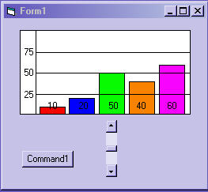



## Simple and Quick Bar Chart \(update\)

### Description

Are you looking for a quick and easy bar chart for you program? Then this just might fill the bill.This is a user control so all you have to do is plug it in,set a few values and go.Howdy from Texas.Ya'll.On update: added Number of Bars (NOB) to show with resize.Also you can now set the scale you want.
 
### More Info
 

             |
---                |---
**Submitted On**   |2004-08-13 23:55:00
**By**             |[Kenneth Foster](https://github.com/Planet-Source-Code/PSCIndex/blob/master/ByAuthor/kenneth-foster.md)
**Level**          |Intermediate
**User Rating**    |5.0 (10 globes from 2 users)
**Compatibility**  |VB 6\.0
**Category**       |[Custom Controls/ Forms/  Menus](https://github.com/Planet-Source-Code/PSCIndex/blob/master/ByCategory/custom-controls-forms-menus__1-4.md)
**World**          |[Visual Basic](https://github.com/Planet-Source-Code/PSCIndex/blob/master/ByWorld/visual-basic.md)
**Archive File**   |[Simple\_and1781688142004\.zip](https://github.com/Planet-Source-Code/kenneth-foster-simple-and-quick-bar-chart-update__1-52362/archive/master.zip)

